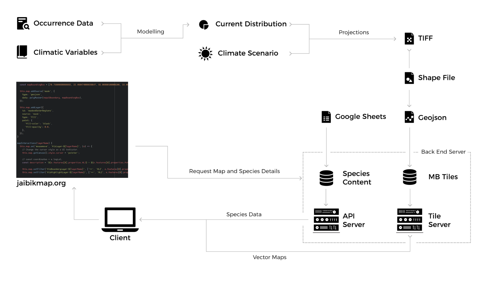

======================
Proposed system design
======================

Please note that this page only describes the specification for the project's final output i.e. the citizen facing web and mobile applications currently in place for the Jaibik Map project and does not include descriptions of other details such as data collection, species distribution modeling methodology, etc.

Challenges
----------

For each mammal, the outputs generated during the modeling exercise comprise of raster (TIFF) files at a :code:`1km*1km` resolution for the whole of Nepal across two different climate change scenarios, and 3 time periods.

Based on this understanding, it was clear that serving such large datasets for smooth, interactive viewing in the web browser was one the major challenges that we needed to address. It was what one would called an optimization problem. How could we ensure that all of the information generated can be quickly made available to the user, while at the same time ensuring that the resolution of the data is not compromised?

Using vector tiles to serve large geospatial datasets
-----------------------------------------------------
Traditionally, the use of standard formats such as GeoJSON has greatly simplified and accelerated the process of developing data driven, web based maps. However, when it comes to serving large datasets that contain hundreds (if not thousands) of geometries, this approach seems to be lacking—the geojson file becomes much larger than what can be handled by the web browser, causing the application to lag/crash.

After a fair amount of research by the technical team, it was clear that the use of vector tile layers could be one possible way to get around this problem. Serving the vector representation of the data—which is much smaller than bitmap images served in any raster tile— would not only help reduce overall data transfer,  but also provide us (developers) access to the data being served in all stages of map development. This, in turn would also enable greater flexibility in terms of data-driven styling and tile layer customization.

Architecture
------------

The flowchart below outlines the overall system architecture followed in Jaibik Map.

As already explained in the previous section, the technical team has used a vector tile server based  architecture to serve geospatial data for consumption in the web and mobile applications. In addition, the team also developed a second API endpoint to serve detailed textual information on all species.

**Serving map data**
********************

The first step involves the conversion of TIFF files (raster) generated from the modeling exercise to vector tiles (MBTiles). To do so, the coordinate system of the TIFF files was first transformed  into the EPGS:4326 coordinate system using the `ogr2ogr <http://www.gdal.org/ogr2ogr.html>`_ utility which is part of `Geometric Data Abstraction Library <http://www.gdal.org/>`_ . After this, the updated TIFF files were first converted into shapefiles and then finally converted to vector tiles in MBTiles format using `Tippecanoe <https://github.com/mapbox/tippecanoe>`_.

The second step then involves serving these vector tiles through a server. To do so, the techical team has made use of `TileServer GL <http://tileserver.org/>`_, which supports both serving vector as well as raster tiles (through Mapbox GL Native).

As a result of this exercise, each mammalian species have five corresponding vector tiles to show species distribution in different climate change and time period scenarios. The current version of the tile server can be found `here <http://159.65.10.210:8090/>`_.

**Serving mammalian species profile data**
******************************************

In addition to serving map data, the Jaibik Map tool also allows users to view  detailed information on all 74 mammalian species. To do so, the team setup a Google Sheets based information upload mechanism to facilitate easy data upload/updation for non-technical team members.

Information uploaded in the Google Sheet was then converted to web-friendly  JSON(Javascript Object Notation). After this, the information was then stored in PostgreSQL database, and species information was then served through API endpoint to facilitate easy, secure consumption by the citizen facing web and mobile apps. Documentation for the API endpoint can be found `in this location <http://159.65.10.210:8080/api/docs/>`_.
